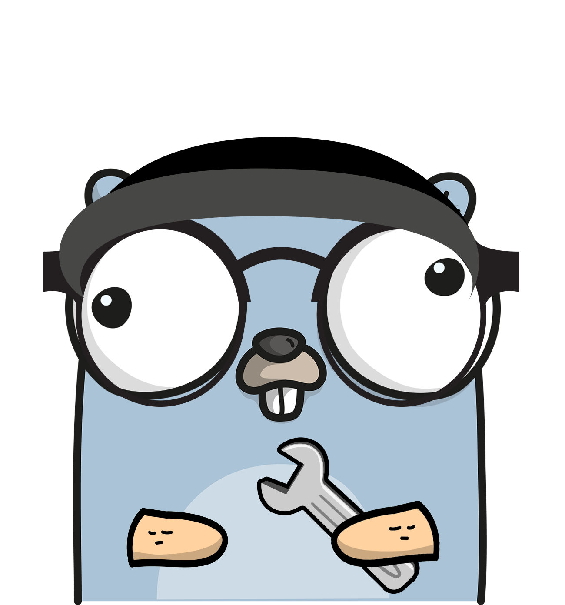

<br>
<div align="center">
  
  <h1>GoEAGI</h1>
  <p>
    A Go library designed to seamlessly integrate with Asterisk's EAGI, offering essential functionalities for enhanced interaction and communication.
  </p>

<!-- Badges -->
<p>
  <a href="https://github.com/andrewyang17/goEagi/graphs/contributors">
    
  </a>
  <a href="">
    
  </a>
  <a href="https://github.com/andrewyang17/goEagi/network/members">
    
  </a>
  <a href="https://github.com/andrewyang17/goEagi/stargazers">
    
  </a>
  <a href="https://github.com/andrewyang17/goEagi/issues/">
    
  </a>
  <a href="https://github.com/andrewyang17/goEagi/blob/master/LICENSE">
    
  </a>
</p>

<h4>
    <a href="https://github.com/andrewyang17/goEagi/issues/">Report Bug</a>
  <span> · </span>
    <a href="https://github.com/andrewyang17/goEagi/issues/">Request Feature</a>
  </h4>
</div>

<br>

## Features

1. Audio Streaming
2. Google's Speech to Text
3. Microsoft Azure's Speech to Text 
4. Vosk server Speech to Text
5. Voice Activity Detection
6. Speech File Generation
7. Commands to Asterisk

<br>

## Example Usage

### Google Speech to Text
```go
package main

import (
	"context"
	"fmt"
	"github.com/andrewyang17/goEagi"
)

func main() {
	eagi, err := goEagi.New()
	if err != nil {
		os.Stdout.WriteString(fmt.Sprintf("error: %v", err))
		os.Exit(1)
	}
	
	googleService, err := goEagi.NewGoogleService("<GoogleSpeechToTextPrivateKey>", "<languageCode>", nil)
	if err != nil {
		eagi.Verbose(fmt.Sprintf("error: %v", err))
		os.Exit(1)
	}
	defer googleService.Close()
	
	ctx, cancel := context.WithCancel(context.Background())
	defer cancel()

	bridgeStream := make(chan []byte)

	audioStream := goEagi.StreamAudio(ctx)
	errCh := googleService.StartStreaming(ctx, bridgeStream)
	googleResponseCh := googleService.SpeechToTextResponse(ctx)

	go func(ctx context.Context, eagi *goEagi.Eagi) {
		for {
			select {
			case <-ctx.Done(): return

			case audio := <-audioStream:
				if audio.Error != nil {
					eagi.Verbose(fmt.Sprintf("audio streaming: G error: %v", audio.Error))
					cancel()
					return
				}
				bridgeStream <- audio.Stream
			}
		}
	}(ctx, eagi)
	
	for {
		select {
		case <-ctx.Done(): return
			
		case err := <-errCh:
			eagi.Verbose(fmt.Sprintf("Google speech to text response: G error: %v", err))
			cancel()
			return

		case response := <-googleResponseCh:
			if response.Error != nil {
				eagi.Verbose(fmt.Sprintf("Google speech to text response: G error: %v", response.Error))
				cancel()
				return
			}

			transcription := response.Result.Alternatives[0].Transcript
			isFinal := response.Result.IsFinal

			eagi.Verbose(fmt.Sprintf("IsFinal: %v, Transcription: %v\n", isFinal, transcription))
		}
	}
	
}
```

<br>

### Microsoft Azure Speech to Text
- Prerequisite - install the [Speech SDK ](https://learn.microsoft.com/en-us/azure/ai-services/speech-service/quickstarts/setup-platform?tabs=macos%2Cubuntu%2Cdotnetcli%2Cdotnet%2Cjre%2Cmaven%2Cnodejs%2Cmac%2Cpypi&pivots=programming-language-go)
- Carefully read the Speech SDK documentation and verify the platform requirements to ensure compatibility with your Asterisk server.
- If it is not possible to install the Speech SDK on your Asterisk server, you can install it on a different machine and stream the audio from your Asterisk server to the Speech SDK.
- For Azure Speech to Text, you need to enable "CGO_ENABLED" flag and build the project with the tag "azure", as shown below:
```sh
CGO_ENABLED=1 go build -tags azure main.go
```
```go
package main

import (
	"context"
	"fmt"
	"os"

	"github.com/andrewyang17/goEagi"
)

func main() {
	eagi, err := goEagi.New()
	if err != nil {
		os.Stdout.WriteString(fmt.Sprintf("error: %v", err))
		os.Exit(1)
	}

	azureService, err := goEagi.NewAzureService("<subscriptionKey>", "serviceRegion", "", []string{"...<language_code>"})
	if err != nil {
		eagi.Verbose(fmt.Sprintf("error: %v", err))
		os.Exit(1)
	}
	defer azureService.Close()

	ctx, cancel := context.WithCancel(context.Background())
	defer cancel()

	bridgeStream := make(chan []byte)

	audioStream := goEagi.StreamAudio(ctx)
	errCh := azureService.StartStreaming(ctx, bridgeStream)
	azureResponseCh := azureService.SpeechToTextResponse(ctx)

	go func(ctx context.Context, eagi *goEagi.Eagi) {
		for {
			select {
			case <-ctx.Done(): return

			case audio := <-audioStream:
				if audio.Error != nil {
					eagi.Verbose(fmt.Sprintf("audio streaming: G error: %v", audio.Error))
					cancel()
					return
				}
				bridgeStream <- audio.Stream
			}
		}
	}(ctx, eagi)
	
	for {
		select {
		case <-ctx.Done(): return
			
		case err := <-errCh:
			eagi.Verbose(fmt.Sprintf("Azure speech to text response: G error: %v", err))
			cancel()
			return

		case response := <-azureResponseCh:
			if response.Error != nil {
				eagi.Verbose(fmt.Sprintf("Azure speech to text response: G error: %v", response.Error))
				cancel()
				return
			}

			if response.Info != "" {
				eagi.Verbose(fmt.Sprintf("Info: %v", response.Info))
				continue
			}

			eagi.Verbose(fmt.Sprintf("IsFinal: %v, Transcription: %v\n", response.IsFinal, response.Transcription))
		}
	}
}
```

<br>

### Vosk

- prerequisite - run the vosk server
```sh
docker run -d -p 2700:2700 alphacep/kaldi-en:latest
```

```go
package main

import (
	"context"
	"fmt"
	"os"

	"github.com/andrewyang17/goEagi"
)

func main() {
	eagi, err := goEagi.New()
	if err != nil {
		os.Stdout.WriteString(fmt.Sprintf("error: %v", err))
		os.Exit(1)
	}

	//use phraseList to list the valid phrases/words. 
	//notes
	//	* if you use a phrase list, Vosk will only detect these words, ignoring any other word
	//	* some Vosk models doesn't support phrase list (I tested with spanish)
	//  * to disable phrase list, leave phraseList empty
	voskService, err := goEagi.NewVoskService("<voskHost>", "<voskPort>", nil)
	if err != nil {
		eagi.Verbose(fmt.Sprintf("error: %v", err))
		os.Exit(1)
	}
	defer voskService.Close()

	ctx, cancel := context.WithCancel(context.Background())
	defer cancel()

	bridgeStream := make(chan []byte)
	defer close(bridgeStream)

	audioStream := goEagi.StreamAudio(ctx)
	errCh := voskService.StartStreaming(ctx, bridgeStream)
	voskResponseCh := voskService.SpeechToTextResponse(ctx)

	go func(ctx context.Context, eagi *goEagi.Eagi) {
		for {
			select {
			case <-ctx.Done(): return

			case audio := <-audioStream:
				if audio.Error != nil {
					eagi.Verbose(fmt.Sprintf("audio streaming: G error: %v", audio.Error))
					cancel()
					return
				}
				bridgeStream <- audio.Stream
			}
		}
	}(ctx, eagi)

	for {
		select {
		case <-ctx.Done(): return
			
		case err := <-errCh:
			eagi.Verbose(fmt.Sprintf("Vosk speech to text response: G error: %v", err))
			cancel()
			return

		case response := <-voskResponseCh:
			// you will receive partial data in v.Partial and, if the full text was recognized, you will receive v.Text.
			eagi.Verbose(fmt.Sprintf("Transcription: %v\n", response.Text))
		}
	}
}
```

<br>

## Contributing
<a href="https://github.com/andrewyang17/goEagi/graphs/contributors">
  
</a>

Made with [contrib.rocks](https://contrib.rocks)

Contributions are always welcome!

<br>

## License
MIT License, see [LICENSE](https://github.com/andrewyang17/goEagi/blob/master/LICENSE).

<br>

## Contact
Andrew Yang - andrewyang177@gmail.com

Project Link: [https://github.com/andrewyang17/goEagi](https://github.com/andrewyang17/goEagi)

<br>

## Acknowledgements
We would like to express our gratitude to the authors and contributors of the following open-source libraries, 
which were used in this project:

- [cloud.google.com/go/speech](cloud.google.com/go/speech): Developed by Google
- [github.com/Microsoft/cognitive-services-speech-sdk-go](github.com/Microsoft/cognitive-services-speech-sdk-go): Developed by Microsoft
- [github.com/cryptix/wav](github.com/cryptix/wav): Developed by Henry Cryptix
- [github.com/zaf/agi](github.com/zaf/agi): Developed by Lefteris Zafiris
- [github.com/gorilla/websocket](github.com/gorilla/websocket): Developed by Gorilla
